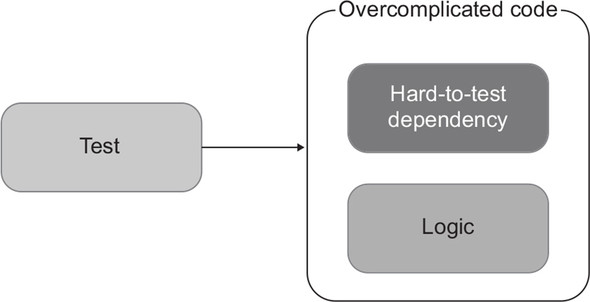
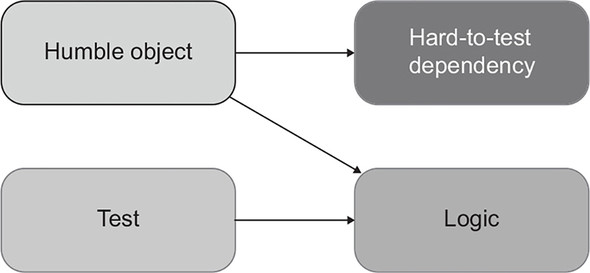
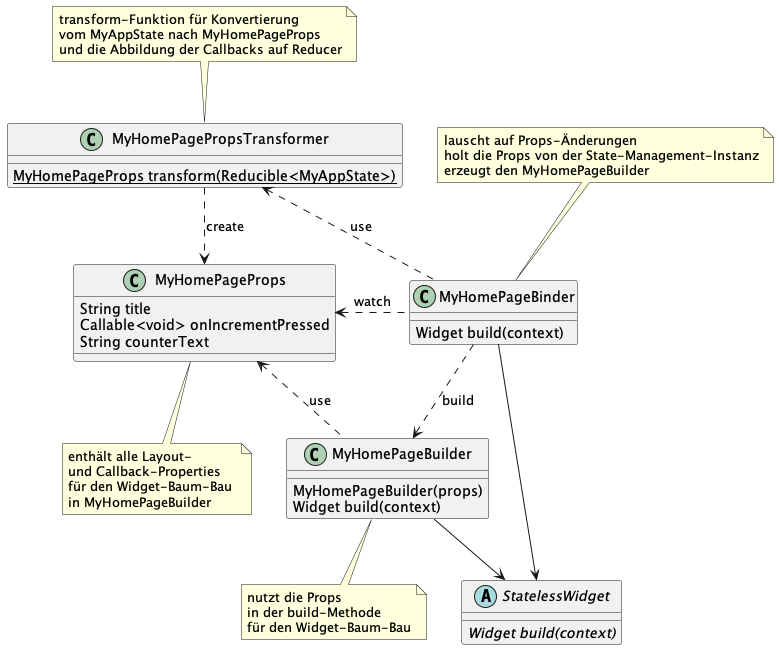
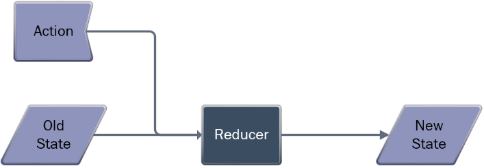
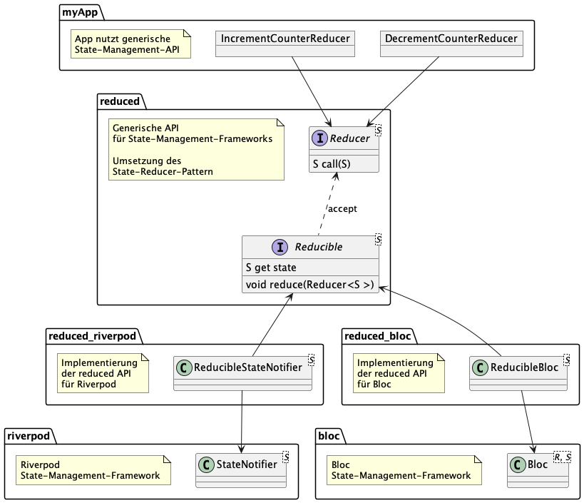

# Entwurfsmuster für das State-Management in Flutter

## Autor

Steffen Nowacki · PartMaster GmbH · [www.partmaster.de](https://www.partmaster.de)

## Abstract

In diesem Artikel wird die Anwendung von zwei Entwurfsmustern vorgestellt, die UI und Logik einer Flutter-App vom verwendeten State-Management-Framework entkoppeln und den Code übersichtlicher machen.
<br/><br/> 
State-Management-Frameworks dienen der Trennung von UI und Logik. Sie haben oft die Nebenwirkung, UI und Logik zu infiltrieren und dadurch ungünstige Abhängigkeiten zu erzeugen. Mit einer Kombination der Entwurfsmuster "State Reducer" und "Humble Object" sowie dem Konzept der Funktionalen Programmierung mit unveränderlichen Zustandsobjekten kann dem entgegengewirkt werden. Die in der Umsetzung der Entwurfsmuster verwendeten Bausteine ```Reducer```, ```Reducible``` und ```Callable``` sowie ```Binder```, ```Builder```, ```Props``` und ```Transformer``` werden in diesem Artikel erklärt. Die entstehende Code-Struktur ist einfacher lesbar, wartbar und testbar und kompatibel zu verbreiteten State-Management-Frameworks, wie Riverpod oder Bloc. 
<br/> 
Diese Vorteile haben ihren Preis: Gegenüber der direkten Verwendung eines State-Management-Frameworks bzw. der Verwendung von veränderlichen Zustandsobjekten ensteht eine zusätzliche Abstraktionsschicht und mehr Boilerplate-Code.
<br/><br/> 
Wer beim Einsatz von State-Management-Frameworks flexibel bleiben will oder wer seine Widget-Baum-Code-Struktur übersichtlicher gestalten will, oder wer sich einfach nur einen Überblick über verfügbare State-Management-Frameworks verschaffen will, für den könnte der Artikel interessant sein. 

<div style="page-break-after: always;"></div>
# Teil 1<br/>Verantwortlichkeiten<br/>in der Counter-Demo-App

Flutter [^1] beschreibt sich selbst mit dem Spruch "Fast alles ist ein Widget" [^2]. Damit ist gemeint, dass die meisten Features in Form von Widget-Klassen implementiert sind, die sich wie Lego-Bausteine aufeinander stecken lassen. Das ist eine großartige Eigenschaft. Es gibt aber auch eine kleine Kehrseite: Wenn man nicht aufpasst, vermischen sich in den resultierenden Widget-Bäumen leicht die Verantwortlichkeiten. 

Nehmen wir als Beispiel die wohlbekannte Counter-Demo-App:

```dart
class _MyHomePageState extends State<MyHomePage> {
  int _counter = 0;

  void _incrementCounter() {
    setState(() {
      _counter++;
    });
  }

  @override
  Widget build(BuildContext context) {
    return Scaffold(
      appBar: AppBar(
        title: Text(widget.title),
      ),
      body: Center(
        child: Column(
          mainAxisAlignment: MainAxisAlignment.center,
          children: <Widget>[
            const Text(
              'You have pushed the button this many times:',
            ),
            Text(
              '$_counter',
              style: Theme.of(context).textTheme.headline4,
            ),
          ],
        ),
      ),
      floatingActionButton: FloatingActionButton(
        onPressed: _incrementCounter,
        tooltip: 'Increment',
        child: const Icon(Icons.add),
      ),
    );
  }
}
```

Die Klasse ```_MyHomePageState``` trägt die verschiedensten Verantwortungen: 

### 1\. Layout

```dart
          mainAxisAlignment: MainAxisAlignment.center,
```

### 2\. Rendering 

```dart
              style: Theme.of(context).textTheme.headline4,
```

### 3\. Gestenerkennng

```dart
        onPressed:
```

### 4\. App-Zustands-Speicherung

```dart
  int _counter = 0;
```

### 5\. App-Zustands-Änderungs-Operationen

```dart
  void _incrementCounter() {
```

### 6\. Widget-Rebuilds nach App-Zustands-Änderungen

```dart
    setState(() {
```

### 7\. Konvertierung des App-Zustands in Anzeige-Properties

```dart
              '$_counter',
```

### 8\. Abbildung von Gesten-Callbacks auf App-Zustands-Änderungs-Operationen

```dart
        onPressed: _incrementCounter,
```
## Fazit zu Verantwortlichkeiten der Counter-Demo-App

Die Klasse ```_MyHomePageState``` der Counter-Demo-App ist ein Beispiel für eine Klasse mit vielen Verantwortlichkeiten. Für eine Demonstration der grundlegenden Flutter-Features ist es verständlich, zugunsten der kompakten Darstellung auf eine Trennung von Verantwortlichkeiten zu verzichten. 
Als Beispiel für Clean-Code [^3] ist die Counter-Demo-App m.E. eher ungeeignet. 
<br/><br/> 
Das Prinzip der Trennung von Verantwortlichkeiten [^4] ist lange bekannt. Trotzdem ist seine Durchsetzung, vor allem innerhalb von UI-Code, nach meiner Erfahrung immer eine Herausforderung. UI-Code hat die Besonderheit, dass er eng an seine Ablaufumgebung, das UI-Framework, gebunden ist und deswegen grundsätzlich schon eine Anfangskomplexität besitzt. Da diese Komplexität des UI-Codes inhärent und nicht vermeidbar ist, bleibt als Ziel nur, sie möglichst wenig zu erhöhen. Und da können auch Lösungen hilfreich sein, die etwas Boilerplate-Code [^5] verursachen.

<div style="page-break-after: always;"></div>
# Teil 2<br/>Anwendung des Humble-Object-Pattern

Ein Entwurfmuster, das genau auf diese Problemlage passt, ist das Humble-Object-Pattern [^6] von Micheal Feathers.

## Die Definition des Humble-Object-Pattern

Die Zusammenfassung des Humble-Object-Pattern lautet: 

> Wenn Code nicht gut testbar ist, weil er zu eng mit seiner Umgebung verbunden ist, extrahiere die Logik in eine separate, leicht zu testende Komponente, die von ihrer Umgebung entkoppelt ist.

Die folgenden zwei Grafiken in Abb. 1 und 2 illustrieren die Lage vor und nach der Anwendung dieses Entwurfsmuster:  


<br/>
*Abb. 1: Lage vor Anwendung des Humble-Object-Pattern (Bildquelle: manning.com [^7])*


<br/>
*Abb. 2: Lage nach Anwendung des Humble-Object-Pattern (Bildquelle: manning.com [^8])*

## Counter-Demo-App Refactored

Für eine kleine Demo App, wie die Counter-Demo-App, ist es angemessen, das so viele Verantwortlichkeiten in einer einzigen Klasse zusammengefasst sind. 
<br/>
Trotzdem habe ich diese App ausgewählt, um an ihr das Humble-Object-Pattern anzuwenden und anhand des Ergebnisses die Brauchbarkeit des Patterns für Flutter-Widget-Bäume zu bewerten. 
<br/><br/>
Hier nun das Ergebnis der Anwendung des Pattern in Form der neuen Klassen, in die die verschiedenen Verantwortlichkeiten (oder Logik-Bestandteile) aus der ursprünglichen Klasse ```_MyHomePageState``` extrahiert wurden, sowie die verbleibende Humble-Object-Klasse ```MyHomePageBuilder```. 
<br/><br/>

|Hinweis|
|---|
| In den extrahierten Klassen habe ich eine Abstraktion für das State-Management-System, bestehend aus den Interfaces ```Reducible```, ```Reducer``` und ```Callable```, der Klasse ```ReducerOnReducible``` sowie den Funktionen ```wrapWithProvider```und ```wrapWithConsumer``` verwendet, die ich später vorstelle. |

### App-Zustands-Speicherung

Für die Speicherung des App-Zustands habe ich zwei Konstrukte vorgesehen:
Eine Klasse ```MyAppState```für den eigentlichen App-Zustand, 
Eine Klasse ```MyAppStateBinder```, die den initialen Wert des App-Zustands festlegt und an die Funktion ```wrapWithProvider``` übergibt. 

Die Funktion ```wrapWithProvider``` abstrahiert das verwendete State-Management-Framework und sorgt dafür, dass es für die nachfolgenden Widgets im Widget-Baum zugreifbar wird. 

#### MyAppState

Um den App-Zustand speichern zu können, habe ich das Property ```counter``` in eine Klasse ```MyAppState```ausgelagert und das Property ```title``` hinzugefügt, obwohl das Property nie geändert wird. 

```dart 
class MyAppState {
  const MyAppState({required this.title, this.counter = 0});

  final String title;
  final int counter;

  MyAppState copyWith({String? title, int? counter}) => MyAppState(
        title: title ?? this.title,
        counter: counter ?? this.counter,
      );

  @override get hashCode => ...
  @override operator ==(other) => ...
}
```

#### MyAppStateBinder

Die Klasse ```MyAppStateBinder``` bindet die spezifische App-Zustands-Klasse ```MyAppState``` mit der Funktion ```wrapWithProvider``` an eine State-Management-Instanz. 

```dart
class MyAppStateBinder extends StatelessWidget {
  const MyAppStateBinder({super.key, required this.child});

  final Widget child;

  @override
  Widget build(context) => wrapWithProvider(
        initialState: const MyAppState(title: 'flutter_bloc'),
        child: child,
      );
}
```

### App-Zustands-Änderungs-Operationen

Die Counter App hat nur eine einzige App-Zustands-Änderungs-Operation.

#### IncrementCounterReducer

Die Methode ```call``` der Klasse ```IncrementCounterReducer``` erzeugt einen neuen ```MyAppState```-Wert in welchem das Property ```counter``` gegenüber dem als Parameter ```state```übergebenen ```MyAppState```-Wert inkrementiert wurde.

Die Basisklasse ```Reducer``` definiert die Signatur der ```call```-Methode für alle App-Zustands-Änderungs-Operationen: ```MyAppState call(MyAppState state);``` und wird später erläutert.

```dart
class IncrementCounterReducer extends Reducer<MyAppState> {
  const IncrementCounterReducer._();

  static const instance = IncrementCounterReducer._();

  @override
  call(state) => state.copyWith(counter: state.counter + 1);
}
```

### Widget-Rebuilds nach App-Zustands-Änderungen

Für die Benachrichtigung über einen notwendigen Rebuild nach App-Zustands-Änderungen habe ich die Funktion ```wrapWithConsumer``` vorgesehen.

Die Funktion ```wrapWithConsumer``` abstrahiert das verwendete State-Management-Framework und sorgt dafür, dass der übergebene ```builder``` bei jeder Änderung des App-Zustandes aufgerufen wird.
Der übergebene ```transformer``` transformiert dabei den eigentlichen ```MyAppState``` in den vom ```builder``` erwarteten Parameter-Typ.   

#### MyHomePageStateBinder

Die Klasse ```MyHomePageStateBinder``` legt fest, dass das Widget ```MyHomePageBuilder``` gebaut wird, und dass die Funktion ```MyHomePagePropsTransformer.transform``` verwendet wird, um den benötigten Konstruktor-Parameter für für Klasse ```MyHomePageBuilder``` zu erzeugen.

```dart
class MyHomePageBinder extends StatelessWidget {
  const MyHomePageBinder({super.key});

  @override
  Widget build(context) =>
      context.bloc<MyAppState>().wrapWithConsumer(
            builder: MyHomePageBuilder.new,
            transformer: MyHomePagePropsTransformer.transform,
          );
}
```

### Konvertierung des App-Zustands in Anzeige-Properties

Bei der Erzeugung des Widget-Baums sind einige Widget-Konstruktor-Properties vom aktuellen App-Zustand abhängig. Diese werden zu eigenen Property-Klassen zusammengefasst. Außerdem wird für jede Property-Klasse eine ```transform```-Funktion definiert, die den App-Zustand in eine Instanz der Property-Klasse transformieren kann.

#### MyHomePageStateProps 

Die in der build-Methode von ```MyHomePageBuilder``` benötigten Properties werden in der Klasse ```MyHomePageProps``` zusammengefasst. 

```dart
class MyHomePageProps {
  const MyHomePageProps({
    required this.title,
    required this.counterText,
    required this.onIncrementPressed,
  });

  final String title;
  final String counterText;
  final Callable<void> onIncrementPressed;

  @override get hashCode => ...
  @override operator ==(other) => ...
}
```

#### MyHomePageStatePropsTransformer

```dart
class MyHomePagePropsTransformer {
  static MyHomePageProps transform(Reducible<MyAppState> reducible) =>
      MyHomePageProps(
        title: reducible.state.title,
        counterText: '${reducible.state.counter}',
        onIncrementPressed: reducible.incrementCounterReducer,
      );
}
```

### Abbildung von Gesten-Callbacks auf App-Zustands-Änderungs-Operationen

Flutter-Widgets stellen für die Gestenverarbeitung und ähnliche Zwecke Callback-Properties zur Verfügung. 
Wir behandeln Callback-Properties genauso wie die bereits besprochenen Anzeige-Properties und fügen sie zur gleichen Properties-Klasse ```MyHomePageProps``` hinzu. Die ```transform```-Funktion erzeugt aus der App-Zustands-Operation ```IncrementCounterReducer```  den Wert für das ```onIncrementPressed```-Callback-Property.

Dazu wird eine Convenience-Methode ```get incrementCounterReducer``` definiert,
die die App-Zustands-Operation mittels der Klasse ```ReducerOnReducible``` an die State-Management-Instanz bindet.

#### get incrementCounterReducer

```dart
extension IncrementCounterReducerOnReducible
    on Reducible<MyAppState> {
  ReducerOnReducible get incrementCounterReducer =>
      ReducerOnReducible(this, IncrementCounterReducer.instance);
}
```

### Layout, Rendering und Gestenerkennung

Die restlichen Verantwortlichkeiten Layout, Rendering und Gestenerkennung konnte ich nicht mehr herauslösen, weil sie sich kaum vom UI-Framework trennen lassen. Sie verbleiben im resultierenden Humble-Object in der Klasse ```MyHomePageStateBuilder```.

#### MyHomePageStateBuilder

In der umgewandelten Counter-Demo-App bildet die Klasse ```MyHomePageBuilder``` das Humble-Object und ist für Layout, Rendering und Gestenerkennung zuständig.

```dart
class MyHomePageBuilder extends StatelessWidget {
  const MyHomePageBuilder({super.key, required this.props});

  final MyHomePageProps props;

  @override
  Widget build(context) => Scaffold(
        appBar: AppBar(
          title: Text(props.title),
        ),
        body: Center(
          child: Column(
            mainAxisAlignment: MainAxisAlignment.center,
            children:  <Widget>[
              const Text(
                'You have pushed the button this many times:',
              ),
              Text(
                props.counterText,
                style: Theme.of(context).textTheme.headlineMedium,
                ),
            ],
          ),
        ),
        floatingActionButton: FloatingActionButton(
          onPressed: props.onIncrementPressed,
          tooltip: 'Increment',
          child: const Icon(Icons.add),
        ),
      );
}
```

## Fazit zur Anwendung des Humble-Object-Pattern

Die Anwendung des Humble-Object-Pattern auf eine Flutter-Widget-Klasse, die einen Widget-Baum erzeugt und Abhängigkeiten vom App-Zustand hat, besteht aus folgenden fünf Schritten: 

1. Wenn die Widget-Klasse sowohl UI-Aufgaben als auch 
App-Zustands-Aufgaben löst, dann wird diese Widget-Klasse in eine Builder-Klasse, eine Binder-Klasse, eine Props-Klasse und eine Transformfunktion zur Erzeugung von Props-Instanzen geteilt.

2. Die Builder-Klasse ist ein ```StatelessWidget```. Sie bekommt von der Binder-Klasse im Konstruktor die Props-Instanz mit vorkonfektionierten Properties und Callbacks und erzeugt in der ```build```-Methode einen Widget-Baum aus Layout-, Renderer und Gestenerkennungs-Widgets.

3. Die Binder-Klasse lauscht bei der State-Management-Instanz selektiv auf Änderungen 'ihrer' Props und liefert in der build-Methode ein Widget der Builder-Klasse zurück. 

4. Für die vorkonfektionierten Properties und Callbacks der Builder-Klasse wird eine Props-Klasse definiert - eine reine Datenklasse mit ausschließlich finalen Feldern.

5. Für die Props-Klasse wird eine Transform-Funktion definiert, die aus dem aktuellen App-Zustand die Werte für die Properties und aus den den Reducer-Implementierungen die Werte für die Callbacks erzeugt.

Das Diagram in Abb. 3 zeigt das Zusammenspiel der Komponenten bei der Umsetzung des Humble-Object-Pattern mit Binder, Builder, Props und Transformer.


*Abb. 3: Umsetzung des Humble-Object-Pattern mit Binder, Builder, Props und Transformer*

Diese Schritte, angewandt auf die Counter-Demo-App, bringen folgendes Ergebnis:

Drei Verantwortlichkeiten aus der Klasse ```_MyHomePageState``` verbleiben im Humble Object:

1. Layout
2. Rendering
3. Abbildung von Gesten-Callbacks auf App-Zustands-Änderungens-Operationen

Fünf Verantwortlichkeiten wurden aus der Klasse ```_MyHomePageState``` in eigene Klassen bzw. Funktionen extrahiert:
  
1. App-Zustands-Speicherung
2. Bereitstellung von Operationen für App-Zustands-Änderungen
3. Widget-Benachrichtigung nach App-Zustands-Änderungen
4. Konvertierung des App-Zustands in Anzeige-Properties
5. Abbildung von Gesten-Callbacks auf App-Zustands-Änderungs-Operationen

Der Source-Code der refaktorisierten Counter-Demo-App kann hier gefunden werden: [github.com/partmaster/reduced/tree/main/examples/counter_app](https://github.com/partmaster/reduced/tree/main/examples/counter_app).
<br/><br/> 
Neben der Counter-Demo-App habe ich das Refactoring nach dem Humble-Object-Pattern auch für das Beispiel-Projekt [Simple app state management](https://docs.flutter.dev/development/data-and-backend/state-mgmt/simple) aus der offiziellen Flutter-Dokumentation für das State-Management durchgeführt. Das Resultat kann hier gefunden werden: [github.com/partmaster/reduced/tree/main/examples/shopper_app](https://github.com/partmaster/reduced/tree/main/examples/shopper_app).
<br/><br/>
In den nach dem Humble-Object-Pattern extrahierten Klassen und Funktionen ist viel Boilerplate-Code entstanden und es wurde eine Abstraktion für das State-Management verwendet. Die Abstraktion besteht aus den Interfaces ```Reducible```, ```Reducer``` und ```Callable```, der  Klasse ```ReducerOnReducible``` sowie den Funktionen ```wrapWithProvider``` und ```wrapWithConsumer```.  
<br/><br/>
Ich hoffe, das Interesse ist geweckt, denn ich will nun die verwendete Abstraktion für das State-Management-System vorstellen. 

<div style="page-break-after: always;"></div>
# Teil 3<br/>Anwendung des State-Reducer-Pattern

Bei allen fünf mittels des Humble-Object-Pattern extrahierten Verantwortlichkeiten handelt es sich um State-Management-Verantwortlichkeiten.<br/><br/> 
In der Counter-Demo-App wird das State-Management mit einem StatefulWidget implementiert. Das StatefulWidget und das InheritedWidget sind die beiden von Flutter bereitgestellten Bausteine für das State-Management. Diese beiden Bausteine sind Low-Level-Bausteine. Nicht-triviale Apps benötigen meist eine höherwertige Lösung für das State-Management. In der Flutter-Community sind viele Frameworks enstanden, um diesen Bedarf zu decken. In der offiziellen Flutter-Dokumentation sind aktuell 13 solcher State-Management-Frameworks gelistet [^9].
<br/><br/>
Nachdem fünf Verantwortlichkeiten mit Mühe (und Boilerplate-Code) aus der Abhängigkeit von der UI-Umgebung gelöst wurden, ist es nur konsequent, sie mittels einer geeigneten Abstraktion auch vor der Abhängigkeit von einem konkreten State-Management-Framework zu bewahren. 
<br/><br/>
Ich nenne die Abstraktion in Anlehnung an das zugrunde liegende Pattern 'reduced'. Die wesentlichen Bestandteile der 'reduced'-Abstraktion wurden bereits aufgezählt:

1. Interface **Reducer**<br/>
Definition von Operationen zur Änderung des App-Zustandes.

2. Interface **Reducible**<br/>
Lesen und Aktualisieren des App-Zustands in einer State-Management-Instanz.

3. Interface **Callable**<br/>
Basis für die Defintion von Klassen mit Wertsemantik [^10], deren Instanzen an Callback-Properties von Flutter-Widgets zugewiesen werden können,<br/> zur Verwendung in den im Kapitel über die Anwendung des Humble-Object-Pattern erwähnten Props-Klassen, so dass diese Klassen ebenfalls mit Wertsemantik definiert werden können.

4. Klasse **ReducerOnReducible**<br/>
Verknüpfung einer App-Zustands-Operation mit der State-Management-Instanz, auf der sie ausgeführt werden soll.

5. Funktion **wrapWithProvider**<br/>
Die Funktion ```wrapWithProvider``` sorgt dafür, dass State-Management-Funktionalität für die nachfolgenden Widgets im Widget-Baum zugreifbar wird. 

6. Funktion **wrapWithConsumer**<br/>
Die Funktion ```wrapWithConsumer``` sorgt dafür, dass der Rebuild eines Widgets durch das State-Management-Framework passend getriggert wird.

## Die Definition des State-Reducer-Pattern

Nach der Übersicht folgt nun die detaillierte Beschreibung der Abstraktion 'reduced' für State-Management-Frameworks. Die Abstraktion ist im Kern eine Anwendung das State-Reducer-Pattern, darum wird zunächst dieses Entwurfmuster vorgestellt.

Einfach ausgedrückt beinhaltet das State-Reducer-Pattern die Forderung, dass jede Änderung am App-Zustand als atomare Operation mit dem aktuellen App-Zustand als Parameter und einem neuen App-Zustand als Resultat ausgeführt wird. Aktionen, die potenziell länger laufen (Datenbank-Anfragen, Netzwerk-Aufrufe, ..), müssen wegen dieser Forderung meist mit mehreren atomaren App-Zustands-Änderungen umgesetzt werden, z.B. eine am Beginn der Aktion und eine am Ende. Entscheidend ist, dass die App-Zustands-Änderung am Ende der Aktion nicht das App-Zustands-Resultat vom Anfang der Aktion als Parameter (wieder-)verwendet, sondern den dann aktuellen App-Zustand des State-Management-Frameworks. Das Pattern unterstützt diese Absicht, indem es dafür sorgt, dass man bei einer Änderung den aktuellen App-Zustand nicht selbst holen muss, sondern unaufgefordert geliefert bekommt.
<br/><br/>
Oder etwas analytischer ausgedrückt: Das State-Reducer-Pattern modelliert den App-Zustand als Ergebnis einer Faltungsfunktion [^11] aus dem initialen App-Zustand und der Folge der bisherigen App-Zustands-Änderungs-Aktionen. 
<br><br/>
Dan Abramov und Andrew Clark haben dieses Konzept im Javascript-Framework Redux [^12] verwendet und für den Kombinierungsoperator, der aus dem aktuellen App-Zustand und einer Aktion einen neuen App-Zustand berechnet, den Namen *Reducer* populär gemacht [^13]:

> Reducers sind Funktionen, die den aktuellen Zustand und eine Aktion als Argumente nehmen und ein neues Zustandsergebnis zurückgeben.<br/> 
Mit anderen Worten: `(state, action) => newState`.


<br/>
*Abb. 4: Prinzip des State-Reducer-Pattern (Bildquelle: killalldefects.com [^14])*

Auf App-Code bezogen heißt das:

1. Für den App-Zustand wird eine AppState-Klasse definiert - eine reine Datenklasse mit ausschließlich finalen Feldern und einem const Konstruktor. Die State-Management-API stellt eine get-Methode für den aktuellen App-Zustand zur Verfügung.  

2. Die State-Management-API stellt eine reduce-Methode zur Verfügung, die einen Reducer als Parameter akzeptiert. Ein Reducer ist eine pure [^15] synchrone Funktion, die eine Instanz der AppState-Klasse als Parameter bekommt und eine neue Instanz der AppState-Klasse als zurückgibt. Beim Aufruf führt die reduce-Methode den übergebenen Reducer mit dem aktuellen App-Zustand als Parameter aus und speichert den Rückgabewert des Reducer-Aufrufs als neuen App-Zustand ab. 

Nach dieser Vorstellung des State-Reducer-Pattern folgen nun die Details zu den Bestandteilen der Abstraktion 'reduced' für State-Management-Frameworks.

## Interface Reducer

Basis-Interface für die Implementierungen von App-Zustands-Änderungs-Operationen das die Signatur der Methode für die Ausführung solcher Operation festlegt. 

```dart
abstract class Reducer<S> {
  S call(S state);
}
```

Neben der Grundvariante des Interfaces gibt es weitere Varianten mit zusätzlichen Parametern für die App-Zustands-Änderungs-Operationen, z.B. mit einem Parameter:

```dart
abstract class Reducer1<S, V> {
  S call(S state, V value);
}
```

## Interface Reducible

Basis-Interface für State-Management-Instanzen mit einem Getter ```get state``` für den AppState und einer Methode ```reduce``` zum Aktualisieren des AppState entsprechend dem State-Reducer-Pattern. 

```dart
abstract class Reducible<S> {
  S get state;
  void reduce(Reducer<S> reducer);
}
```

## Interface Callable

Basis-Interface für Implementierungen von Callbacks. Die Implementierung von Callbacks als Klassen und nicht als Funktionen erlaubt das Überschreiben von ```get hashCode``` und ```operator==(other)```für Wertsemantik.

```dart
abstract class Callable<R> {
  R call();
}
```

Neben der Grundvariante des Interfaces gibt es weitere Varianten mit zusätzlichen Parametern für die Callbacks, z.B. mit einem Parameter:

```dart
abstract class Callable1<R, V> {
  R call(V value);
}
```

## Klasse ReducerOnReducible

Die Klasse implementiert das Interface ```Callable``` mit einem ```Reducer``` und einem ```Reducible``` indem bei Ausführung des Callbacks die Methode ```reduce``` des Reducible mit dem Reducer als Parameter ausgeführt wird.


```dart
class ReducerOnReducible<S> extends Callable<void> {
  const ReducerOnReducible(this.reducible, this.reducer);

  final Reducible<S> reducible;
  final Reducer<S> reducer;

  @override call() => reducible.reduce(reducer);

  @override get hashCode => ...
  @override operator ==(other) => ...
}
```

Neben der Grundvariante des Klasse gibt es weitere Varianten mit zusätzlichen Parametern für die Callbacks, z.B. mit einem Parameter:

```dart
class Reducer1OnReducible<S, V> extends Callable1<void, V> {
  const Reducer1OnReducible(this.reducible, this.reducer);

  final Reducible<S> reducible;
  final Reducer1<S, V> reducer;

  @override call(value) =>
      reducible.reduce(Reducer1Adapter(reducer, value));

  @override get hashCode => ...
  @override operator ==(other) => ...
}
```

## Funktion wrapWithProvider

Die Funktion ```wrapWithProvider``` sorgt dafür, dass State-Management-Funktionalität für die nachfolgenden Widgets im Widget-Baum zugreifbar wird. 
<br/><br/>
Die Funktion hat immer einen Parameter ```child``` vom Typ Widget. Die komplette Signatur der Funktion ist abhängig vom State-Management-Framework,.
<br/><br/>
In der Implementierung wird das übergebene ```child```-Widget oft in ein sogenanntes 'Provider'-Widget eingepackt, welches im Widget-Baum den Zugriff auf eine State-Management-Instanz zur Verfügung stellt. 

## Funktion wrapWithConsumer

Die Funktion ```wrapWithConsumer``` sorgt dafür, dass der Rebuild eines Widgets durch das State-Management-Framework passend getriggert wird.
<br/><br/>
Die Funktion hat immer einen Parameter ```builder``` vom Typ Function mit dem Returntyp Widget. Die komplette Signatur der Funktion ist abhängig vom State-Management-Framework. 
<br/><br/>
In der Implementierung wird der übergebenene ```builder``` oft in ein sogenanntes 'Consumer'-Widget eingepackt, dass den ```builder``` genau dann ausführt, wenn sich relevante Properties der State-Management-Instanz ändern.
Die Funktion ```wrapWithConsumer``` ermöglicht es also, selektiv auf Zustandsänderungen zu lauschen.

## Fazit zur Anwendung des State-Reducer-Pattern

Auf Basis des State-Reducer-Pattern wurde eine minimale API für State-Management-Frameworks definiert,
die die grundlegenden State-Management-Anwendungsszenarien abdeckt.
Durch die Reduktion auf das Notwendige lässt sich die API leicht für existierende State-Management-Frameworks implementieren, wie gleich noch gezeigt wird.
Der Source-Code für die API kann hier gefunden werden: [github.com/partmaster/reduced](https://github.com/partmaster/reduced)
<br/><br/>
Da die 'reduced'-API für jedes konkrete State-Management-Framework nur einmal implementiert werden muss, verursacht sie keinen zusätzlichen Boilerplate-Code, sondern nur eine zusätzliche Abstraktionsschicht. 
Aber auch jede Abstraktionsschicht verursacht Aufwände, die gegenüber dem Nutzen abgewogen werden sollten.
<br/>
Die 'reduced'-API deckt nur den 'Standard-Teil' der APIs der State-Management-Frameworks ab. Jedes Framework bietet über die 'reduced'-API hinaus noch individuelle Features. Um auch solche Features nutzen zu können, kann man die 'reduced'-API erweitern oder an der 'reduced'-API vorbei direkt mit der Framework-API arbeiten.
<br/>
Falls in einem Projekt die Notwendigkeit für direkte Nutzung der State-Management-Framework-API kein Ausnahmefall bleibt, dann ist es wahrscheinlich, dass die Nutzung einer Abstraktionsschicht für das State-Management-Framework in so einem Projekt ungünstig ist. 

<div style="page-break-after: always;"></div>
# Teil 4<br/>Implementierung der 'reduced'-API

Eine Implementierung der 'reduced'-API für ein konkretes State-Management-Framework besteht aus der Implementierung des Interfaces ```Reducible``` sowie den Implementierungen der Funktionen ```wrapWithProvider```und ```wrapWithConsumer```. Optional kann noch eine Extension für den ```BuildContext``` hinzukommen, die einen bequemen Zugriff auf die State-Management-Instanz bereitstellt.
<br/>
Wie eine 'reduced'-Implementierung aussieht, soll beispielhaft anhand der Frameworks 'Bloc' [^16] und 'Riverpod' [^17] gezeigt werden.


*Abb. 5: Beziehungen zwischen 'reduced'-API, API-Implementierungen und API-Verwendung*

## 'reduced'-API-Implementierung am Beispiel Bloc

Das State-Management-Framework 'Bloc' [^16] von Felix Angelov basiert auf dem Bloc-Pattern [^18] von Paolo Soares und Cong Hui.

### Reducible-Implementierung für Bloc

Das Framework Bloc implementiert State-Management-Instanzen mit der Klasse ```Bloc<E, S>```, wobei ```E``` der Typ-Parameter für State-Management-Ereignisse und ```S``` der Typ-Parameter für die Zustands-Klasse ist. Wir verwenden als Ereignis-Typ das Interface ```Reducer``` aus der 'reduced'-API. Da die ```Reducer``` ihre Operation auf dem App-Zustannd schon mitbringen, brauchen sie kein individuelles Dispatching, sondern sie können selbst ausgeführt werden. Die Methode ```S get state``` bringt die Klasse ```Bloc``` bereits mit und die Methode ```Reducible.reduce``` kann direkt auf die Methode ```Bloc.add``` abgebildet werden.  

```dart
class ReducibleBloc<S> extends Bloc<Reducer<S>, S>
    implements Reducible<S> {
  ReducibleBloc(super.initialState) {
    on<Reducer<S>>((event, emit) => emit(event(state)));
  }

  @override
  void reduce(Reducer<S> reducer) => add(reducer);

  late final reducible = this;
}
```

### Extension für den BuildContext

```dart
extension ExtensionBlocOnBuildContext on BuildContext {
  ReducibleBloc<S> bloc<S>() =>
      BlocProvider.of<ReducibleBloc<S>>(this);
}
```

### wrapWithProvider-Implementierung für Bloc

Die Funktion ```wrapWithProvider``` erzeugt das Widget ```ProviderScope```.

```dart
Widget wrapWithProvider<S>({
  required S initialState,
  required Widget child,
}) =>
    BlocProvider(
      create: (_) => ReducibleBloc(initialState),
      child: child,
    );
```

### wrapWithConsumer-Implementierung für Bloc

Die Funktion ```wrapWithConsumer``` erzeugt das Widget ```BlocSelector```.
Die benötigte ```Reducible```-Instanz wird implizit übergeben, indem ```wrapWithConsumer``` als Extension der Klasse ```ReducibleBloc``` definiert wird.

```dart
extension WrapWithConsumer<S> on ReducibleBloc<S> {
  Widget wrapWithConsumer<P>({
    required ReducibleTransformer<S, P> transformer,
    required PropsWidgetBuilder<P> builder,
  }) =>
      BlocSelector<ReducibleBloc<S>, S, P>(
        selector: (state) => transformer(reducible),
        builder: (context, props) => builder(props: props),
      );
}
```

## 'reduced'-API-Implementierung am Beispiel Riverpod

Das State-Management-Framework 'Riverpod' [^17] von Remi Rousselet.

### Reducible-Implementierung für Riverpod

Das Framework Riverpod implementiert State-Management-Instanzen mit der Klasse ```StateNotifier<S>```, wobei ```S``` der Typ-Parameter für die Zustands-Klasse ist. Die Methode ```S get state``` bringt die Klasse ```StateNotifier``` bereits mit und die Methode ```Reducible.reduce``` kann einfach auf die Methode ```set state(S)``` abgebildet werden.  

```dart
class ReducibleStateNotifier<S> extends StateNotifier<S>
    implements Reducible<S> {
  ReducibleStateNotifier(super.state);

  late final Reducible<S> reducible = this;

  @override
  reduce(reducer) => state = reducer(state);
}
```

### Extension für dem BuildContext

Riverpod benötigt keine Extension für den BuildContext.

### wrapWithProvider-Implementierung für Riverpod

Die Funktion wrapWithProvider erzeugt das Widget ```ProviderScope```.

```dart
Widget wrapWithProvider({required Widget child}) =>
    ProviderScope(child: child);
```

### wrapWithConsumer-Implementierung für Riverpod

Die Funktion ```wrapWithConsumer``` erzeugt das Widget ```Consumer```.
Durch den Consumer bekommt man ein WidgetRef damit bekommt man bei jeder Änderund die aktuellen Props.

```dart
Widget wrapWithConsumer<S, P>({
  required StateProvider<P> provider,
  required PropsWidgetBuilder<P> builder,
}) =>
    Consumer(
      builder: (_, ref, __) => builder(props: ref.watch(provider)),
    );
```

### Tabelle der 'reduced'-API-Implementierungen

In der Flutter-Dokumentation sind aktuell 13 State Management Frameworks gelistet. Das Fish-Redux-Framework [^19] ist nicht Null-Safe [^20] und darum veraltet. Für die anderen 12 Frameworks wurde die 'reduced'-API exemplarisch implementiert. Die folgende Tabelle enthält Links zu diesen Frameworks und zu ihren 'reduced'-Implementierungen.

|Name|Publisher|'reduced'-Implementierung|
|---|---|---|
|[Binder](https://pub.dev/packages/binder)|[romainrastel.com](https://pub.dev/publishers/romainrastel.com)|[reduced_binder](https://github.com/partmaster/reduced/tree/main/approaches/reduced_binder)|
|[Fish Redux](https://pub.dev/packages/fish_redux)|[Alibaba](https://github.com/alibaba)|-|
|[Flutter Bloc](https://pub.dev/packages/flutter_bloc)|[bloclibrary.dev](https://pub.dev/publishers/bloclibrary.dev)|[reduced_bloc](https://github.com/partmaster/reduced/tree/main/approaches/reduced_bloc)|
|[Flutter Command](https://pub.dev/packages/flutter_command)|[escamoteur](https://github.com/escamoteur)|[reduced_fluttercommand](https://github.com/partmaster/reduced/tree/main/approaches/reduced_fluttercommand)|
|[Flutter Triple](https://pub.dev/packages/flutter_triple)|[flutterando.com.br](https://pub.dev/publishers/flutterando.com.br/packages)|[reduced_fluttertriple](https://github.com/partmaster/reduced/tree/main/approaches/reduced_fluttertriple)|
|[GetIt](https://pub.dev/packages/get_it)|[fluttercommunity.dev](https://pub.dev/publishers/fluttercommunity.dev)|[reduced_getit](https://github.com/partmaster/reduced/tree/main/approaches/reduced_getit)|
|[GetX](https://pub.dev/packages/get)|[getx.site](https://pub.dev/publishers/getx.site)|[reduced_getx](https://github.com/partmaster/reduced/tree/main/approaches/reduced_getx)|
|[MobX](https://pub.dev/packages/flutter_mobx)|[dart.pixelingene.com](https://pub.dev/publishers/dart.pixelingene.com)|[reduced_mobx](https://github.com/partmaster/reduced/tree/main/approaches/reduced_mobx)|
|[Provider](https://pub.dev/packages/provider)|[dash-overflow.net](https://pub.dev/publishers/dash-overflow.net)|[reduced_provider](https://github.com/partmaster/reduced/tree/main/approaches/reduced_provider)|
|[Redux](https://pub.dev/packages/flutter_redux)|[brianegan.com](https://pub.dev/publishers/brianegan.com)|[reduced_redux](https://github.com/partmaster/reduced/tree/main/approaches/reduced_redux)|
|[Riverpod](https://pub.dev/packages/flutter_riverpod)|[dash-overflow.net](https://pub.dev/publishers/dash-overflow.net)|[reduced_riverpod](https://github.com/partmaster/reduced/tree/main/approaches/reduced_riverpod)|
|[Solidart](https://pub.dev/packages/flutter_solidart)|[bestofcode.dev](https://pub.dev/publishers/bestofcode.dev)|[reduced_solidart](https://github.com/partmaster/reduced/tree/main/approaches/reduced_solidart)|
|[States Rebuilder](https://pub.dev/packages/states_rebuilder)|[Mellati Fatah](https://github.com/GIfatahTH)|[reduced_statesrebuilder](https://github.com/partmaster/reduced/tree/main/approaches/reduced_statesrebuilder)|

## Fazit zur Implementierung der 'reduced'-API

Die Ziel der 'reduced'-API ist eine minimale Abstraktionsschicht für State-Management-Frameworks.   
Der geringe Code-Umfang und die direkten Abbildungen in den Implementierungen der 'reduced'-API zeigen, dass dieses Ziel erreicht wurde. Die 'reduced'-API passt sehr gut auf die meisten Frameworks. 
<br/>
Beim State-Management-Framework MobX [^21] musste allerdings, um die Funktionen ```wrapWithProvider``` und ```wrapWithConsumer``` bereitzustellen, gegen das Framework gearbeitet werden: Die 'reduced'-API-Funktionen sind so ausgelegt, dass sie die State-Management-Instanzen mit generischen Klassen zur Laufzeit erstellen und benutzen. Dagegen verwendet MobX spezifische State-Management-Klassen, die bereits beim Build mit einem Code-Generator generiert werden. 
<br/><br/>
Durch die Verwendung der 'reduced'-API wird neben der Trennung von Verantwortlichkeiten auch eine Unabhängigkeit vom State-Management-Framework möglich: die refaktorisierte Counter-Demo-App läuft mit allen 12 gelisteten und verfügbaren Frameworks. In der Datei [binder.dart](https://github.com/partmaster/reduced/blob/30dbd8c3060b5d46ddcd160c19d8c00badd06e2a/examples/counter_app/lib/view/binder.dart) kann das in der Counter-Demo-App verwendete State-Management-Framework umgeschaltet werden, indem die entsprechende ```export```-Anweisung ausgeführt (vom den Kommentar-Zeichen befreit) wird:

```dart
// export 'binder/binder_binder.dart';
// export 'binder/bloc_binder.dart';
// export 'binder/fluttercommand_binder.dart';
// export 'binder/fluttertriple_binder.dart';
// export 'binder/getit_binder.dart';
// export 'binder/getx_binder.dart';
// export 'binder/mobx_binder.dart';
// export 'binder/provider_binder.dart';
// export 'binder/redux_binder.dart';
// export 'binder/riverpod_binder.dart';
// export 'binder/setstate_binder.dart';
// export 'binder/solidart_binder.dart';
export 'binder/statesrebuilder_binder.dart';
```

<div style="page-break-after: always;"></div>
# Offene Enden

## Grauzonen zwischen UI und App-Logik

Zur Implementierung einiger UI-Aktionen benötigt man einen [BuildContext]. Ein prominentes Beispiel ist die Navigation zwischen App-Seiten mit [Navigator.of(BuildContext)]. Die Entscheidung, wann zu welcher App-Seite navigiert wird, ist App-Logik. Die App-Logik sollte möglichst ohne Abhängigkeiten von der UI-Ablaufumgebung bleiben, und ein [BuildContext] repräsentiert quasi diese Ablaufumgebung. 
</br></br>
Ein ähnliches Problem sind UI-Ressourcen wie Bilder, Icons, Farben und Fonts, die eine Abhängigkeit zur UI-Ablaufumgebung besitzen und deren Bereitstellung UI-App-Logik erfordern kann. 
Zwischen UI-Code und App-Logik-Code gibt es also noch Grauzonen, die in klare Abgrenzungen umgewandelt werden sollten. (Im Fall des [Navigator]s gibt es mit dem Property [MaterialApp.navigatorKey] einen möglichen Workaround für die Navigation zwischen App-Seiten ohne [BuildContext].) 
 
## Lokale bzw. geschachtelte App-Zustände

Der Ansatz, den kompletten App-Zustand als unveränderliche Instanz einer einzigen Klasse zu modellieren, wird bei sehr komplexen Datenstrukturen, sehr großen Datenmengen oder sehr häufigen Änderungsaktionen an seine Grenzen kommen [^22].
</br></br>
In der redux.js-Dokumentation gibt es Hinweise [^23], [^24], wie man diese Grenzen durch eine gute Strukturierung der App-Zustands-Klasse erweitern kann.
</br></br>
Letztlich kann man versuchen, Performance-kritische Teile aus dem globalen App-Zustand zu extrahieren und mit lokalen State-Management-Lösungen umzusetzen. 
Im State-Management-Framework Fish-Redux [^19] ist es z.B. grundsätzlich so, dass (neben einen globalen App-Zustand) für jede App-Seite eine lokale State-Management-Instanz existiert.  

## UI-Code-Strukturierung

In diesem Artikel wurden Code-Struktur und Entwurfsmuster für eine Trennung der Verantwortlichkeiten von UI-Code und App-Logik-Code diskutiert. 
</br></br>
Eine separierte App-Logik kann man mit allen verfügbaren Architektur-Ansätzen und Entwurfmustern weiterstrukturiert werden.
</br></br>
Für den separierten Flutter-UI-Code werden allerdings für größere Projekte weitere  Strukturierungskonzepte benötigt:

* Wie separiere ich das Theming, z.B. Light Mode und Dark Mode?

* Wie separiere ich die Layout-Adaptionen für verschiedene Endgeräte-Gruppen, z.B. Smartphone, Tablet, Desktop, Drucker ? 

* Wie separiere ich den Code für die Layout-Responsivness für Änderungen der App-Display-Größe zwischen den Adaptionsstufen ?

* Wie separiere ich den Code für Animationen?

## Praxis-Erprobung

Die in diesem Artikel vorgestellte Code-Struktur ist ein Ergebnis meiner Erfahrungen aus kleinen und mittleren Flutter-Projekten. Eines davon ist das Projekt Cantarei - die Taizé-Lieder-App. Die App ist frei im Apple- [^25] und im Google- [^26] App-Store verfügbar, so dass jeder Interessierte selbst einen Eindruck gewinnen kann, für welche Projekt-Größen die hier vorgeschlagenen Konzepte bereits praxiserprobt sind. Ob sie sich, so wie sie sind, mit Erfolg auf viele und vor allem auch auf größere Projekte anwenden lassen, muss sich erst noch erweisen.

# Schlußwort

In der Software-Entwicklung ist Übermotivation ungünstig. Jede Abstraktion zum Verbergen von Abhängigkeiten verursacht Kosten und sollte genug Vorteile bringen, um die Kosten zu rechtfertigen [^27]. Ich hoffe, die 'reduced'-Abstraktion, insbesondere in Kombination mit der Anwendung des Humble-Object-Pattern, ist den Aufwand wert.

<div style="page-break-after: always;"></div>
# Referenzen

[^1]: Flutter</br> [flutter.dev](https://flutter.dev/)

[^2]: Alles ist ein Widget</br> [docs.flutter.dev/development/ui/layout](https://docs.flutter.dev/development/ui/layout)

[^3]: Clean-Code</br> [de.wikipedia.org/wiki/Clean_Code](https://de.wikipedia.org/wiki/Clean_Code)

[^4]: Trennung der Verantwortlichkeiten</br> [en.wikipedia.org/wiki/Separation_of_concerns](https://en.wikipedia.org/wiki/Separation_of_concerns)

[^5]: Boilerplate Code [de.wikipedia.org/wiki/Boilerplate-Code](https://de.wikipedia.org/wiki/Boilerplate-Code)

[^6]: Humble Object Pattern</br> [xunitpatterns.com/Humble Object.html](http://xunitpatterns.com/Humble%20Object.html)

[^7]: Vor dem Humble-Object-Pattern [livebook.manning.com/book/unit-testing/chapter-7/49](https://livebook.manning.com/book/unit-testing/chapter-7/49)

[^8]: Nach dem Humble-Object-Pattern [livebook.manning.com/book/unit-testing/chapter-7/51](https://livebook.manning.com/book/unit-testing/chapter-7/51)

[^9]: Flutter State Management Approaches</br> [docs.flutter.dev/development/data-and-backend/state-mgmt/options](https://docs.flutter.dev/development/data-and-backend/state-mgmt/options)

[^10]: Wertsemantik</br> [en.wikipedia.org/wiki/Value_semantics](https://en.wikipedia.org/wiki/Value_semantics)

[^11]: Faltungsfunktion</br> [www.cs.nott.ac.uk/~gmh/fold.pdf](http://www.cs.nott.ac.uk/~gmh/fold.pdf)

[^12]: Redux</br> [redux.js.org/](https://redux.js.org/)

[^13]: Reducer Pattern</br> [redux.js.org/tutorials/fundamentals/part-3-state-actions-reducers](https://redux.js.org/tutorials/fundamentals/part-3-state-actions-reducers)

[^14]: Prinzip des State-Reducer-Pattern (killalldefects.com/2019/12/28/rise-of-the-reducer-pattern/)[https://killalldefects.com/2019/12/28/rise-of-the-reducer-pattern/]

[^15]: Pure Funktion</br> [en.wikipedia.org/wiki/Pure_function](https://en.wikipedia.org/wiki/Pure_function)

[^16]: Bloc</br> [bloclibrary.dev](https://bloclibrary.dev/)

[^17]: Riverpod</br> [riverpod.dev](https://riverpod.dev/)

[^18]: Bloc Pattern<br/> [www.youtube.com/watch?v=PLHln7wHgPE](https://www.youtube.com/watch?v=PLHln7wHgPE)

[^19]: Fish Redux [pub.dev/packages/fish_redux](https://pub.dev/packages/fish_redux)

[^20]: Null Safety [dart.dev/null-safety#enable-null-safety](https://dart.dev/null-safety#enable-null-safety)

[^21]: MobX [mobx.netlify.app/](https://mobx.netlify.app/)

[^22]: Reducer Pattern Nachteil</br> [twitter.com/acdlite/status/1025408731805184000](https://twitter.com/acdlite/status/1025408731805184000)

[^23]: App-Zustands-Gliederung</br> [redux.js.org/usage/structuring-reducers/basic-reducer-structure](https://redux.js.org/usage/structuring-reducers/basic-reducer-structure)

[^24]: App-Zustands-Normalisierung</br> [redux.js.org/usage/structuring-reducers/normalizing-state-shape](https://redux.js.org/usage/structuring-reducers/normalizing-state-shape)

[^25]: Die App *Cantarei* im Apple-Appstore [apps.apple.com/us/app/cantarei/id1624281880](https://apps.apple.com/us/app/cantarei/id1624281880)

[^26]: Die App *Cantarei* im Google-Playstore [play.google.com/store/apps/details?id=de.partmaster.cantarei](https://play.google.com/store/apps/details?id=de.partmaster.cantarei)

[^27]: Unvorteilhafte Abstraktionen [twitter.com/remi_rousselet/status/1604603131500941317](https://twitter.com/remi_rousselet/status/1604603131500941317)
